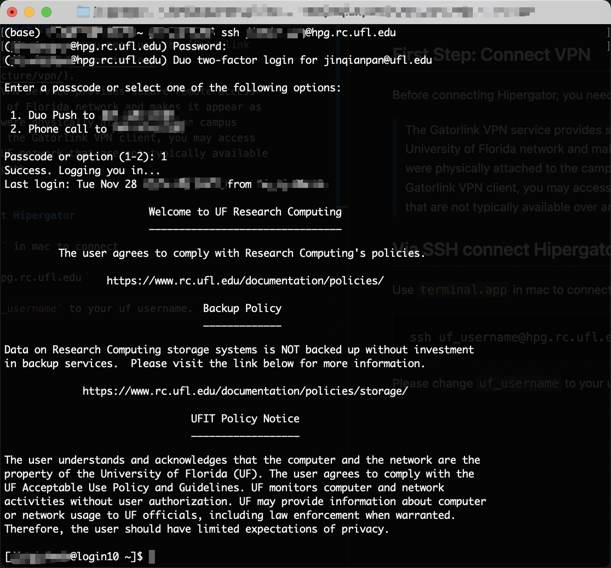
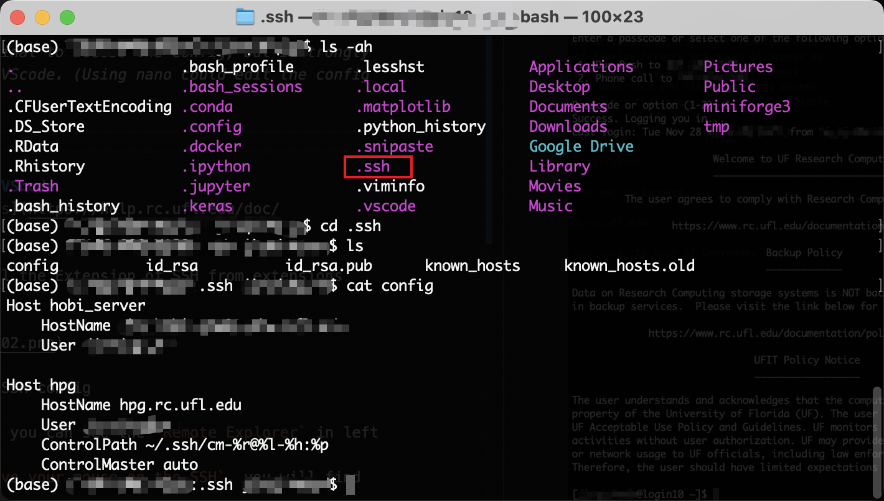
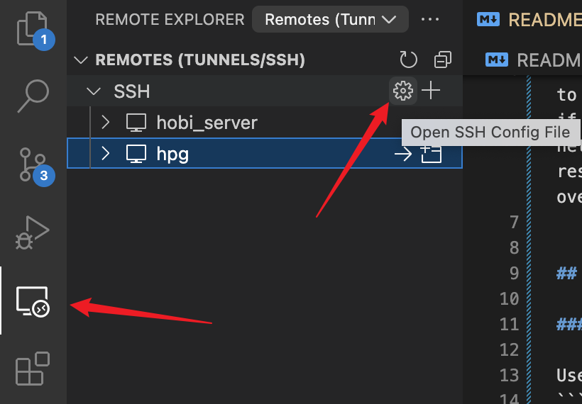
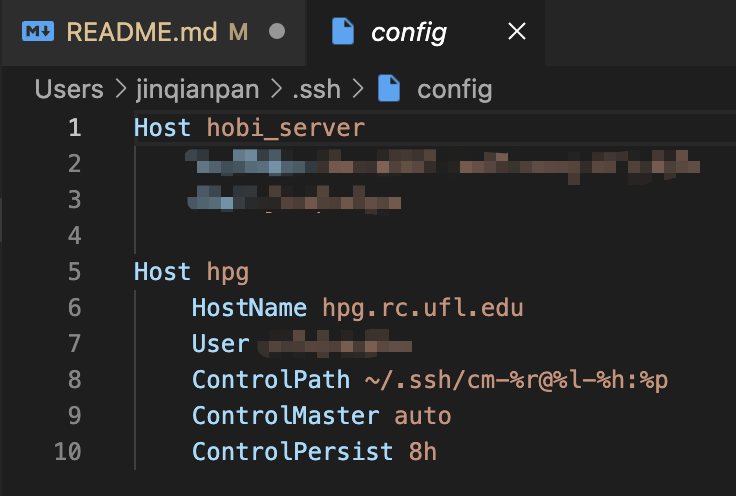
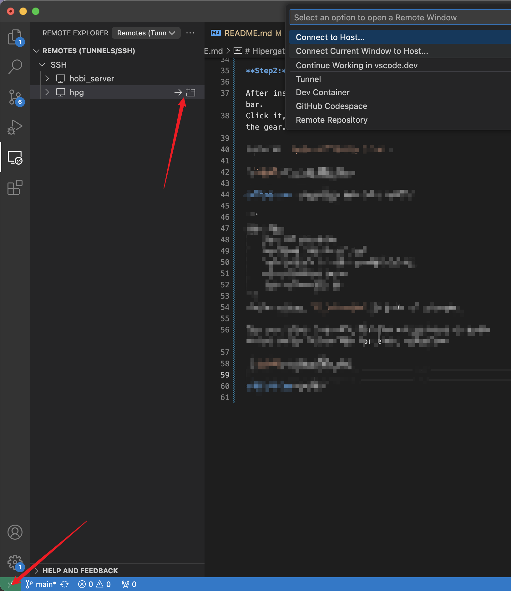

# Hipergator
HiPerGator is the University of Florida's supercomputer.

## 01 First Step: Connect VPN
Before connecting Hipergator, you need use the [Gatorlink VPN](https://it.ufl.edu/ict/documentation/network-infrastructure/vpn/). 
>  The Gatorlink VPN service provides secure remote access to the University of Florida network and makes it appear as if your computer were physically attached to the campus network. By using the Gatorlink VPN client, you may access resources on the UF network that are not typically available over an Internet path. 


## 02 Via SSH connect Hipergator

### 0201 Through Terminal

Use `terminal.app` in mac to connect 
```
ssh uf_username@hpg.rc.ufl.edu
```
Please change `uf_username` to your uf username.

<!--  -->
<p align="center">
  
</p>

After typing password and select option, you are in the Hipergator.

*You can use terminal to access the config, but I strongly recommand to use VScode. The guide is in 0202.*


*Using nano could edit config file.*

### 0202 Through VScode
[Offical Documents](https://help.rc.ufl.edu/doc/SSH_Using_VSCode)

**Step1:** Install the Extension of SSH from extensions store.


**Step2:** Setup SSH config

After installing, you can see the `Remote Explorer` in left bar. 
Click it, and `move your mouse on the SSH`, you will find the gear.

Click to `Open SSH Config File`.



**Step3:** Copy&Paste and edit config

```
Host hpg
    User uf_username
    HostName hpg.rc.ufl.edu
    ControlPath ~/.ssh/cm-%r@%l-%h:%p
    ControlMaster auto
    ControlPersist 8h
```
Please change `uf_username` to your uf username.

The last three line help for SSH Multiplexing to avoid having to go through MFA for every connection.



**Step4:** Connect

There are two ways in VScode. You can see two arrows in the image006.


`Now you can type` ssh hpg `in the terminal to connect.`

## 03