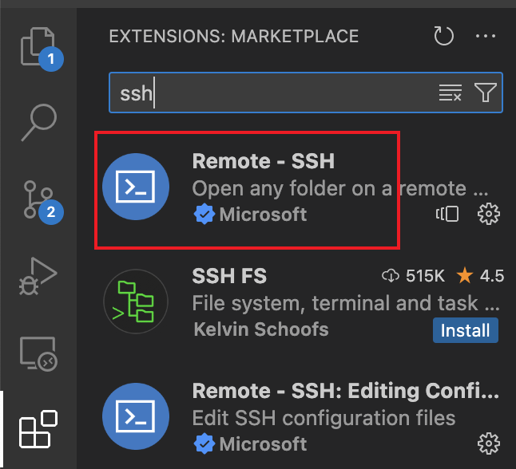

Edit by `Jan 26, 2024`

## Content Table
- [01 First Step: Connect VPN](#01-first-step-connect-vpn)
- [02 Via SSH connect Hipergator](#02-via-ssh-connect-hipergator)
    - [0201 Through Terminal](#0201-through-terminal)
    - [0202 Through VScode](#0202-through-vscode)
    - [0203 Connect SSH](#0203-connect-ssh)
- [03 03 Introduce to hipergator](#03-introduce-to-hipergator)
    - [0301 Storage](#0301-storage)
        - [030101 Intro for storage](#030101-intro-for-storage)
        - [030102 Code for accessing different storage](#030102-code-for-accessing-different-storage)
        - [030103 Groups](#030103-groups)
    - [0302 Recourses](#0302-recourses)
        - [030201 VScode & Terminal](#030201-vscode--terminal)
        - [030202 Jupyter Notebook](#030202-jupyter-notebook)
    - [0303 Managing Python environments and Jupyter kernels](#0303-managing-python-environments-and-jupyter-kernels)
        - [030301 Python environments](#030301-python-environments)
        - [030302 Jupyter kernels](#030302-jupyter-kernels)
    - [0304 Coding](#0304-coding)

***

# Hipergator

HiPerGator is the University of Florida's supercomputer. [Official Documents for Hipergator](https://help.rc.ufl.edu/doc/Getting_Started)

## 01 First Step: Connect VPN
Before connecting Hipergator, you need use the [Gatorlink VPN](https://it.ufl.edu/ict/documentation/network-infrastructure/vpn/). 
>  The Gatorlink VPN service provides secure remote access to the University of Florida network and makes it appear as if your computer were physically attached to the campus network. By using the Gatorlink VPN client, you may access resources on the UF network that are not typically available over an Internet path. 

***

## 02 Via SSH connect Hipergator

### 0201 Through Terminal

Use `terminal.app` in mac to connect 
```
ssh uf_username@hpg.rc.ufl.edu
```
Please change `uf_username` to your uf username.

<!--  -->
<p align="center">
  
</p>

After typing password and select option, you are in the Hipergator.

> [!TIP]
> You can use terminal to access the config, but I strongly recommand to use VScode. The guide is in 0202.

<!--  -->
<p align="center">
  
</p>

*Using nano could edit config file.*

---
### 0202 Through VScode

[Official Documents for VScode](https://help.rc.ufl.edu/doc/SSH_Using_VSCode)

**Step1:** Install the Extension of SSH from extensions store.

<!--  -->
<p align="center">
  
</p>


**Step2:** Setup SSH config

After installing, you can see the `Remote Explorer` in left bar. 
Click it, and `move your mouse on the SSH`, you will find the gear.

Click to `Open SSH Config File`.

<!--  -->
<p align="center">
  
</p>


**Step3:** Copy&Paste and edit config

[Official Documents for SSH Multiplexing](https://help.rc.ufl.edu/doc/SSH_Multiplexing)

```
Host hpg
    User uf_username
    HostName hpg.rc.ufl.edu
    ControlPath ~/.ssh/cm-%r@%l-%h:%p
    ControlMaster auto
    ControlPersist 8h
```
Please change `uf_username` to your uf username.

The last three line help for SSH Multiplexing to avoid having to go through MFA for every connection.

<!--  -->
<p align="center">
  
</p>

---

### 0203 Connect SSH

There are two ways in VScode. You can see two arrows in the image006.
<!--  -->
<p align="center">
  
</p>


Now you can type `ssh hpg` in the terminal to connect.
<p align="center">
  
</p>

***

## 03 Introduce to hipergator
### 0301 Storage 

[Official Documents for Storage](https://help.rc.ufl.edu/doc/Storage)

The storage has be divided in 4 part: home storage, blue storage, orange storage, and red storage.

Generally, we use home storage, blue storage, and orange storage.

#### 030101 Intro for storage

**Home Storage:** When you log in, the first thing that appears in front of you is home storage. 
> It is permissible to keep `software builds, conda environments, text documents, and valuable scripts in $HOME` as it is somewhat protected by daily snapshots.

**Blue Storage:** This part is responsible for reading and writing. Under the condition that the data can be placed, we will put the data required for code running in this area.

**Orange Storage:** Data storage area (if our data can't be put in the blue storage, we will also put the data here).

> [!IMPORTANT]
> Run Efficiency: Home Storage > Blue Storage > Orange Storage
> Storage Space: Orange Storage >> Blue Storage >> Home Storage

#### 030102 Code for accessing different storage 

**Path**
```
cd /blue
cd /orange
```

**Checking Quotas and Managing Space**
```
home_quota
blue_quota
orange_quota
```

#### 030103 Groups

> [!IMPORTANT]
> We cannot store our data directly in storages. We need first check what group we are. `And then store the data in that group.`
```
slurmInfo
```
This code would display resource usage for your group.

---

### 0302 Recourses
We have three ways to get the computational recourses: srun, slurm, and OOD.

- `srun` and `slurm` are working on terminal.

- `OOD` is working on Jupyter.

#### 030201 VScode & Terminal
Because connection to VScode is easy to edit our code and VScode also includes terminal, most time, we would use VScode.

<p align="center">
  
</p>

**SRUN:**
For the `srun`, you can just open the terminal from VScode and type the resourses you want. The Hipergator will allocate resources to you in your setting time (Shows in the bottom of image009). For more detail, please read the [Official Documents for Srun](https://help.rc.ufl.edu/doc/Development_and_Testing).

This method is only suitable for debugging code. When debugging the code, you need to run `slurm` to complete the running of the code.

**SLRUM:**
For the `slurm`, you need to create a sbatch file first (the suffix is .sbatch). And enter the instructions you need resources into this file, then get the environment and run the python code. Just like what I show in the top and left of Image009. For more detail, please read the [Official Documents for SLURM](https://help.rc.ufl.edu/doc/Sample_SLURM_Scripts).

> [!TIP]
> - module purge: clear all imported software environments.
> - module load: load the environments you want.
> ```
> module purge
> module load cuda/12.2.0  intel/2020  openmpi/4.1.5 vasp/6.4.1
> ```

#### 030202 Jupyter Notebook
You can use [https://ood.rc.ufl.edu/](https://ood.rc.ufl.edu/) to run the code on Jupyter Notebook/Lab.

---

### 0303 Managing Python environments and Jupyter kernels

#### 030301 Python environments
The Hipergator has already a number of module for us. For more detail, please read the [Official Documents for Module](https://help.rc.ufl.edu/doc/Applications).

For loading these module:
```
module load env
```

However, we always want to build our own conda environment. [Official Documents for Conda Environment](https://help.rc.ufl.edu/doc/Managing_Python_environments_and_Jupyter_kernels)

For running GPU in feature, we need to install 
```
mamba install cudatoolkit=11.3 pytorch=1.12.1=gpu_cuda* -c pytorch
```

Before creating the environment, we need to load conda.
```
module load conda
```

Create the environment, change the name of the env and python version.
```
mamba create -n name python=3.9
```

And then you can use any command line of conda and pip.

>[!TIP]
> Everytime you want use conda, you need to load it first:
>```
> module load conda
>
> conda activate myenv
>```


#### 030302 Jupyter kernels
Still need to figure out how to do this.

---

### 0304 Coding

#### 030401 VScode
> [!WARNING]
> Before coding in the VScode, please request resource first!

After getting resource and create a python file, we first set python interpreter.

First click the interpreter in the right bottom of VScode, just like image010.
<p align="center">
  
</p>

And paste the path below. (Remamber change the UF_username and env_name)
```
/home/UF_username/.conda/envs/env_name/bin/
```

> [!CAUTION]
> Although VScode could also open Jupyter file and find kernel use before method, the resource which we request COULD NOT use in this Jupyter.
> If you want to use Jupyter, PLEASE go to OOD!